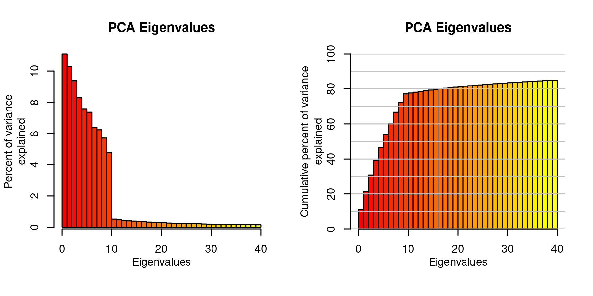

## Candidate loci

https://www.ncbi.nlm.nih.gov/nuccore/?term=Cannabis%20ALT4

https://www.ncbi.nlm.nih.gov/search/all/?term=Cannabis%20BKR


## Methods


### Genome Wide Association Study

In order to discover variants associated with the varin phenotype, a Genome Wide Association Study (GWAS) was performed using GAPIT3 (https://doi.org/10.1016/j.gpb.2021.08.005).
The varin data was ordered quantile (ORQ) normalization transformed using the 'bestNormalize::orderNorm()' function (10.32614/RJ-2021-041; 10.1080/02664763.2019.1630372) to improve normalcy.
Genotypic data in the VCF format (https://doi.org/10.1093/bioinformatics/btr330) was imported into R (https://www.R-project.org/) using vcfR (https://doi.org/10.1111/1755-0998.12549) and converted to hapmap format using vcfR::vcfR2hapmap().
The ordered quantile normalized phenotypes and the hapmap format genotypes were used for GWAS using the function GAPIT::GAPIT() and the options PCA.total = 6 and model = "Blink".
The Blink model begins with a simple model where the phenotype is described as a function of the dosage of the alternate allele in the genotypes.
These are sorted by p-value.
The first variant is selected subsequent loci that are determined to be in linkage disequilibrium with the first are removed.
This is iterated through subsequent variants until the remaining variants are all organized by linkage.
Detail on the Blink method can be found in it's publication (https://doi.org/10.1093/gigascience/giy154).


**Figure X.** Manhattan plot exploring genome wide genotype association with the phenotypic trait 'varin content'.
Points indicated the genomic location and significance of association for each variant.
The size and transparency of each point was scaled by it's significance.


```{r setup, include=FALSE}
#knitr::opts_chunk$set(echo = TRUE)
knitr::opts_chunk$set(echo = FALSE)
knitr::opts_chunk$set(fig.align = "center")
knitr::opts_chunk$set(fig.width = 12)
# knitr::opts_chunk$set(results = "hide")
knitr::opts_chunk$set(results = "markup")

```


## Phenotypes


```{r, results='hide'}
pheno <- readxl::read_xlsx("ERB x HO40 23 S1 Phenotypes_original_XT.xlsx")
pheno[1:3, ]
```


```{r}
par(mfrow=c(1, 2))

hist(pheno$Total)
hist(pheno$OrderNorm_transformed)

par(mfrow=c(1, 1))
```


## PCA


```{r pca, echo=FALSE, fig.cap="A caption", out.width = '80%'}

```


## Manhattan plots


```{r}
my_mhs <- c(
  "/media/knausb/E737-9B48/knausb/allele_hw/GAPIT3_blink_v2/GAPIT.Association.GWAS_Results.BLINK.Varin_Total.csv",
  "/media/knausb/E737-9B48/knausb/allele_hw/GAPIT3_blink_v3_pca6/GAPIT.Association.GWAS_Results.BLINK.Varin_Total.csv",
  "/media/knausb/E737-9B48/knausb/allele_hw/GAPIT3_blink_v3_pca6_normP/GAPIT.Association.GWAS_Results.BLINK.Varin_Total.csv",
  "/media/knausb/E737-9B48/knausb/allele_hw/GAPIT3_blink_v3_pca9/GAPIT.Association.GWAS_Results.BLINK.Varin_Total.csv",
  "/media/knausb/E737-9B48/knausb/allele_hw/GAPIT3_blink_v3_pca10_normP/GAPIT.Association.GWAS_Results.BLINK.Total.csv",
  "/media/knausb/E737-9B48/knausb/allele_hw/GAPIT3_blink_v3_pca10_normP/GAPIT.Association.GWAS_Results.BLINK.OrderNorm_transformed.csv",
  "/media/knausb/E737-9B48/knausb/allele_hw/GAPIT3_blink_v3_pca20/GAPIT.Association.GWAS_Results.BLINK.Varin_Total.csv"
  )

my_names <- sub("/media/knausb/E737-9B48/knausb/allele_hw/GAPIT3_blink_v3_", "", my_mhs)
my_names <- sub("pca10_normP/GAPIT.Association.GWAS_Results.BLINK.Total.csv", "pca10_BLINK, Varin", my_names)
my_names <- sub("pca10_normP/GAPIT.Association.GWAS_Results.BLINK.OrderNorm_transformed.csv", "pca10_BLINK, OrderNorm_Varin", my_names)

my_names <- sub("/GAPIT.Association.GWAS_Results.", "_", my_names)
my_names <- sub(".csv", "", my_names)
my_names <- sub("normP_BLINK.Total", "Blink, OrderNorm_Varin", my_names)
my_names <- sub("normP_BLINK.Varin_Total", "Blink, OrderNorm_Varin", my_names)
my_names <- sub("normP_BLINK.OrderNorm_transformed", "Blink, OrderNorm_Varin", my_names)

my_names[1] <- "pca3_BLINK.Varin_Total"
my_names[1] <- "pca3_BLINK.Varin_Total"
my_names

length(my_mhs) == length(my_names)

```


```{r}
nucs <- read.csv("nucs.csv.gz")
# nucs[1:3, 1:5]
```


```{r}
# x <- "/media/knausb/E737-9B48/knausb/allele_hw/GAPIT3_blink_v3_pca6/GAPIT.Association.GWAS_Results.BLINK.Varin_Total.csv"

mh_plot <- function(x, main = "main", detail1 = TRUE, detail2 = TRUE ){
  gwas <- read.csv(x)

  if(length(grep("POS", names(gwas))) == 0){
  #is.na(gwas$POS) <- TRUE
  gwas$POS <- gwas$Pos
    for(i in 2:nrow(nucs)){
      gwas$POS[ gwas$Chr == nucs$Id[i] ] <- gwas$Pos[ gwas$Chr == nucs$Id[i] ] + sum( nucs$Length[1:(i - 1)] )
    }
  }

  if(length(grep("chrom_num", names(gwas))) == 0){
    gwas$chrom_num <- sub(".+\\chr", "", gwas$Chr)
    gwas$chrom_num[ gwas$chrom_num == "X" ] <- 10
    gwas$chrom_num[ gwas$chrom_num == "Y" ] <- 11
    gwas$chrom_num <- as.numeric( gwas$chrom_num )
  }
  
  my_pal <- c("#420A6866", "#D94D3D66", "#FCAF1366", "#BF395266", 
              "#81206C66", "#62146E66", "#ED692566", "#A12A6366", 
              "#F98B0B66", "#F6D64566"
  )
  
  palette(my_pal)
  gwas$col <- my_pal[gwas$chrom_num]
  gwas$col <- substr(gwas$col, start = 1, stop = 7)

  my_ps <- -log10(gwas$P.value)
  my_ps <- my_ps/max(my_ps) * 235
  my_ps <- my_ps + 20
  my_ps <- round(my_ps)
  range(my_ps)
  my_ps <- as.hexmode(my_ps)
  my_ps <- format(my_ps, width = 2)

  gwas$col <- paste(gwas$col, my_ps, sep = "")
  #table(nchar(gwas$col))

  plot(x = gwas$POS, y = -log10(gwas$P.value), 
     col = gwas$col,
     pch = 20, xlab = "", ylab = "", xaxt = "n",
     cex = -log10(gwas$P.value) * 0.20)

  abline(h = seq(0, 30, by = 1), lty = 3, col = "#C0C0C088")
  abline(h = seq(0, 30, by = 5), lty = 1, col = "#C0C0C088")
  axis(side = 1, at = nucs$mids, labels = c(1:9, "X"))
  title( xlab = "Chromosome (EH23b)", line = 2 )
  title( ylab = expression("-Log"["10"](italic(p)-value)), line = 1.8 )
  title( main = main )
  #title( main = "Varin content (Blink model; Varin_Total)" )
  
  abline( v = sum(nucs$Length[1:6]) + 1010217 ) # ALT4
#  text( x = sum(nucs$Length[1:6]) + 1010217 + 0, y = 20, labels = "ALT4" ) # ALT4
  text( x = sum(nucs$Length[1:6]) + 1010217 + 0, y = 8, labels = "ALT4" ) # ALT4
  abline( v = sum(nucs$Length[1:3]) + 72420315 ) # BKR
  text( x = sum(nucs$Length[1:3]) + 72420315, y = 8, labels = "BKR" ) # BKR
#  text( x = sum(nucs$Length[1:3]) + 72420315, y = 20, labels = "BKR" ) # BKR

  if( detail1 == TRUE ){
    # Detail BKR
    plot(x = gwas$POS, y = -log10(gwas$P.value), 
      col = gwas$chrom_num,
      #col = gwas$col,
      pch = 20, xlab = "", ylab = "", xaxt = "n",
      cex = -log10(gwas$P.value) * 0.20 * 4, 
      xlim = c( sum(nucs$Length[1:3]) + 66e6, sum(nucs$Length[1:3]) + 76e6 )
    )

    abline(h = seq(0, 30, by = 1), lty = 3, col = "#C0C0C088")
    abline(h = seq(0, 30, by = 5), lty = 1, col = "#C0C0C088")
    axis(side = 1, at = nucs$mids, labels = c(1:9, "X"))
    my_xs <- seq(0, 800e6, by = 1e6)
    axis(side = 1, at = my_xs, labels = my_xs/1e6)
    title( xlab = "Chromosome (EH23b)", line = 2 )
    title( ylab = expression("-Log"["10"](italic(p)-value)), line = 1.8 )
    title( main = main )
    #title( main = "Varin content (Blink model; Varin_Total)" )
  
    abline( v = sum(nucs$Length[1:6]) + 1010217 ) # ALT4
#  text( x = sum(nucs$Length[1:6]) + 1010217 + 0, y = 20, labels = "ALT4" ) # ALT4
    text( x = sum(nucs$Length[1:6]) + 1010217 + 0, y = 8, labels = "ALT4" ) # ALT4
    abline( v = sum(nucs$Length[1:3]) + 72420315 ) # BKR
    text( x = sum(nucs$Length[1:3]) + 72420315, y = 8, labels = "BKR" ) # BKR
#  text( x = sum(nucs$Length[1:3]) + 72420315, y = 20, labels = "BKR" ) # BKR
  
    #BKR
    rect(xleft = sum(nucs$Length[1:3]) + 67626398, 
       ybottom = 0,
       xright = sum(nucs$Length[1:3]) + 68382150, 
       ytop = 40, 
       col = "#90EE9044", border = NA)
  }

  if( detail2 == TRUE ){
    # Detail ALT4
    plot(x = gwas$POS, y = -log10(gwas$P.value), 
      col = gwas$chrom_num,
      #col = gwas$col,
      pch = 20, xlab = "", ylab = "", xaxt = "n",
      cex = -log10(gwas$P.value) * 0.20 * 4, 
      xlim = c( sum(nucs$Length[1:6]) - 1e6, sum(nucs$Length[1:6]) + 4e6 )
    )

    abline(h = seq(0, 30, by = 1), lty = 3, col = "#C0C0C088")
    abline(h = seq(0, 30, by = 5), lty = 1, col = "#C0C0C088")
    axis(side = 1, at = nucs$mids, labels = c(1:9, "X"))
    my_xs <- seq(0, 800e6, by = 1e6)
    axis(side = 1, at = my_xs, labels = my_xs/1e6)
    title( xlab = "Chromosome (EH23b)", line = 2 )
    title( ylab = expression("-Log"["10"](italic(p)-value)), line = 1.8 )
    title( main = main )
    #title( main = "Varin content (Blink model; Varin_Total)" )
  
    abline( v = sum(nucs$Length[1:6]) + 1010217 ) # ALT4
#  text( x = sum(nucs$Length[1:6]) + 1010217 + 0, y = 20, labels = "ALT4" ) # ALT4
    text( x = sum(nucs$Length[1:6]) + 1010217 + 0, y = 8, labels = "ALT4" ) # ALT4
    abline( v = sum(nucs$Length[1:3]) + 72420315 ) # BKR
    text( x = sum(nucs$Length[1:3]) + 72420315, y = 8, labels = "BKR" ) # BKR
#  text( x = sum(nucs$Length[1:3]) + 72420315, y = 20, labels = "BKR" ) # BKR

    # ALT4
    rect(xleft = sum(nucs$Length[1:6]) + 290840 - 0, 
      ybottom = 0,
      xright = sum(nucs$Length[1:6]) + 290913 + 0, 
      ytop = 40, 
      col = "#90EE9044", border = "#90EE90")
  #abline( v = sum(nucs$Length[1:6]) + 290913, col = "#90EE90" )
  }
  
  # Table
  gwas2 <- gwas[sort.int(gwas$P.value, decreasing = FALSE, index.return = TRUE)$ix, ]
  gwas3 <- data.frame( gwas2[, c(1, 4)],
                       '-log10(P)' = -log10(gwas2$P.value),
                       gwas2[, c(5, 6, 7, 8, 9, 3)]
                       )
  names(gwas3)[3] <- "-log10(P)"
  gwas3 <- gwas3[1:10, ]
  
  knitr::kable(gwas3, 
               caption = "**Table X.** Select results from GAPIT GWAS using the Blink model, sorted by P.value.",
               row.names = FALSE)
  
}

```


```{r}
#mh_plot(my_mhs[1], main = "Varin content; Blink model; PCA.total = 3")
```


```{r}
#
mh_plot(my_mhs[2], main = "Varin content; Blink model; PCA.total = 6")
# 
mh_plot(my_mhs[2], main = "Varin content; Blink model; PCA.total = 6", detail1 = F, detail2 = F)
```


```{r}
#mh_plot(my_mhs[3], main = "Varin content; Blink model; PCA.total = 9")
```


```{r}
#mh_plot(my_mhs[4], main = "Varin content; Blink model; PCA.total = 20")
```


```{r}
#mh_plot(my_mhs[5], main = "Varin content; Blink model; PCA.total = 6; Normalized phenotypes")
```


## Loop


```{r}
i <- 2
for( i in 1:length(my_mhs)){
  mh_plot(my_mhs[i], main = my_names[i], detail1 = FALSE, detail2 = FALSE)
}
```


## PCA = 6


```{r}
# svg(filename = "mh_varin_pca6.svg", width = 6.5, height = 3.5)
# mh_plot(my_mhs[2], main = my_names[2], detail1 = FALSE, detail2 = FALSE)
# dev.off()
```


```{r}

gwas <- read.csv(my_mhs[2])

if(length(grep("POS", names(gwas))) == 0){
  #is.na(gwas$POS) <- TRUE
  gwas$POS <- gwas$Pos
  for(i in 2:nrow(nucs)){
      gwas$POS[ gwas$Chr == nucs$Id[i] ] <- gwas$Pos[ gwas$Chr == nucs$Id[i] ] + sum( nucs$Length[1:(i - 1)] )
  }
}

if(length(grep("chrom_num", names(gwas))) == 0){
    gwas$chrom_num <- sub(".+\\chr", "", gwas$Chr)
    gwas$chrom_num[ gwas$chrom_num == "X" ] <- 10
    gwas$chrom_num[ gwas$chrom_num == "Y" ] <- 11
    gwas$chrom_num <- as.numeric( gwas$chrom_num )
}
  
my_pal <- c("#420A6866", "#D94D3D66", "#FCAF1366", "#BF395266", 
              "#81206C66", "#62146E66", "#ED692566", "#A12A6366", 
              "#F98B0B66", "#F6D64566"
)
  
palette(my_pal)
gwas$col <- my_pal[gwas$chrom_num]
gwas$col <- substr(gwas$col, start = 1, stop = 7)

my_ps <- -log10(gwas$P.value)
my_ps <- my_ps/max(my_ps) * 235
my_ps <- my_ps + 20
my_ps <- round(my_ps)
range(my_ps)
my_ps <- as.hexmode(my_ps)
my_ps <- format(my_ps, width = 2)

gwas$col <- paste(gwas$col, my_ps, sep = "")
#table(nchar(gwas$col))

svg(filename = "mh_varin_pca6.svg", width = 6.5, height = 3.5)

par( mar = c(3, 3, 2, 0.1) )

plot(x = gwas$POS, y = -log10(gwas$P.value), 
     col = gwas$col,
     pch = 20, xlab = "", ylab = "", xaxt = "n",
     cex = -log10(gwas$P.value) * 0.20)

  abline(h = seq(0, 30, by = 1), lty = 3, col = "#C0C0C088")
  abline(h = seq(0, 30, by = 5), lty = 1, col = "#C0C0C088")
  axis(side = 1, at = nucs$mids, labels = c(1:9, "X"))
  title( xlab = "Chromosome (EH23b)", line = 2 )
  title( ylab = expression("-Log"["10"](italic(p)-value)), line = 1.8 )
  title( main = my_names[2] )
  #title( main = "Varin content (Blink model; Varin_Total)" )
  
  abline( v = sum(nucs$Length[1:6]) + 1010217 ) # ALT4
#  text( x = sum(nucs$Length[1:6]) + 1010217 + 0, y = 20, labels = "ALT4" ) # ALT4
  text( x = sum(nucs$Length[1:6]) + 1010217 + 0, y = 8, labels = "ALT4" ) # ALT4
  abline( v = sum(nucs$Length[1:3]) + 72420315 ) # BKR
  text( x = sum(nucs$Length[1:3]) + 72420315, y = 8, labels = "BKR" ) # BKR
#  text( x = sum(nucs$Length[1:3]) + 72420315, y = 20, labels = "BKR" ) # BKR

dev.off()


par( mar = c(5, 4, 4, 2) )


```

