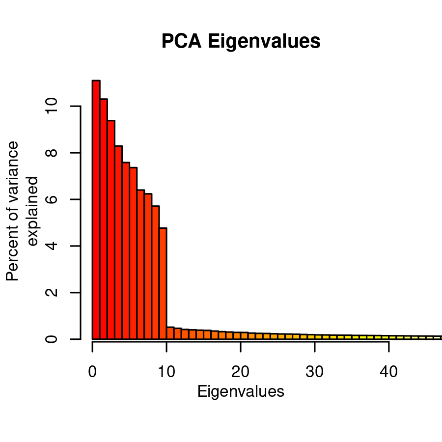

https://www.ncbi.nlm.nih.gov/nuccore/?term=Cannabis%20ALT4

https://www.ncbi.nlm.nih.gov/search/all/?term=Cannabis%20BKR


```{r setup, include=FALSE}
#knitr::opts_chunk$set(echo = TRUE)
knitr::opts_chunk$set(echo = FALSE)
knitr::opts_chunk$set(fig.align = "center")
knitr::opts_chunk$set(fig.width = 12)
# knitr::opts_chunk$set(results = "hide")
knitr::opts_chunk$set(results = "markup")

```


## PCA


```{r pca, echo=FALSE, fig.cap="A caption", out.width = '60%'}

```


## Manhattan plots


```{r}
my_mhs <- c(
  "/media/knausb/E737-9B48/knausb/allele_hw/GAPIT3_blink_v2/GAPIT.Association.GWAS_Results.BLINK.Varin_Total.csv",
  "/media/knausb/E737-9B48/knausb/allele_hw/GAPIT3_blink_v3_pca6/GAPIT.Association.GWAS_Results.BLINK.Varin_Total.csv",
  "/media/knausb/E737-9B48/knausb/allele_hw/GAPIT3_blink_v3_pca9/GAPIT.Association.GWAS_Results.BLINK.Varin_Total.csv",
  "/media/knausb/E737-9B48/knausb/allele_hw/GAPIT3_blink_v3_pca20/GAPIT.Association.GWAS_Results.BLINK.Varin_Total.csv"
  )
```


```{r}
nucs <- read.csv("nucs.csv.gz")
# nucs[1:3, 1:5]
```


```{r}

mh_plot <- function(x, main = "main" ){
  gwas <- read.csv(x)

  if(length(grep("POS", names(gwas))) == 0){
  #is.na(gwas$POS) <- TRUE
  gwas$POS <- gwas$Pos
    for(i in 2:nrow(nucs)){
      gwas$POS[ gwas$Chr == nucs$Id[i] ] <- gwas$Pos[ gwas$Chr == nucs$Id[i] ] + sum( nucs$Length[1:(i - 1)] )
    }
  }

  if(length(grep("chrom_num", names(gwas))) == 0){
    gwas$chrom_num <- sub(".+\\chr", "", gwas$Chr)
    gwas$chrom_num[ gwas$chrom_num == "X" ] <- 10
    gwas$chrom_num[ gwas$chrom_num == "Y" ] <- 11
    gwas$chrom_num <- as.numeric( gwas$chrom_num )
  }
  
  my_pal <- c("#420A6866", "#D94D3D66", "#FCAF1366", "#BF395266", 
              "#81206C66", "#62146E66", "#ED692566", "#A12A6366", 
              "#F98B0B66", "#F6D64566"
  )
  
  palette(my_pal)
  gwas$col <- my_pal[gwas$chrom_num]
  gwas$col <- substr(gwas$col, start = 1, stop = 7)

  my_ps <- -log10(gwas$P.value)
  my_ps <- my_ps/max(my_ps) * 235
  my_ps <- my_ps + 20
  my_ps <- round(my_ps)
  range(my_ps)
  my_ps <- as.hexmode(my_ps)
  my_ps <- format(my_ps, width = 2)

  gwas$col <- paste(gwas$col, my_ps, sep = "")
  #table(nchar(gwas$col))

  plot(x = gwas$POS, y = -log10(gwas$P.value), 
     col = gwas$col,
     pch = 20, xlab = "", ylab = "", xaxt = "n",
     cex = -log10(gwas$P.value) * 0.20)

  abline(h = seq(0, 30, by = 1), lty = 3, col = "#C0C0C088")
  abline(h = seq(0, 30, by = 5), lty = 1, col = "#C0C0C088")
  axis(side = 1, at = nucs$mids, labels = c(1:9, "X"))
  title( xlab = "Chromosome (EH23b)", line = 2 )
  title( ylab = expression("-Log"["10"](italic(p)-value)), line = 1.8 )
  title( main = main )
  #title( main = "Varin content (Blink model; Varin_Total)" )
  
  abline( v = sum(nucs$Length[1:6]) + 1010217 ) # ALT4
#  text( x = sum(nucs$Length[1:6]) + 1010217 + 0, y = 20, labels = "ALT4" ) # ALT4
  text( x = sum(nucs$Length[1:6]) + 1010217 + 0, y = 8, labels = "ALT4" ) # ALT4
  abline( v = sum(nucs$Length[1:3]) + 72420315 ) # BKR
  text( x = sum(nucs$Length[1:3]) + 72420315, y = 8, labels = "BKR" ) # BKR
#  text( x = sum(nucs$Length[1:3]) + 72420315, y = 20, labels = "BKR" ) # BKR
    
  # Detail BKR
  plot(x = gwas$POS, y = -log10(gwas$P.value), 
     col = gwas$chrom_num,
     #col = gwas$col,
     pch = 20, xlab = "", ylab = "", xaxt = "n",
     cex = -log10(gwas$P.value) * 0.20 * 4, 
     xlim = c( sum(nucs$Length[1:3]) + 66e6, sum(nucs$Length[1:3]) + 76e6 ))

  abline(h = seq(0, 30, by = 1), lty = 3, col = "#C0C0C088")
  abline(h = seq(0, 30, by = 5), lty = 1, col = "#C0C0C088")
  axis(side = 1, at = nucs$mids, labels = c(1:9, "X"))
  my_xs <- seq(0, 800e6, by = 1e6)
  axis(side = 1, at = my_xs, labels = my_xs/1e6)
  title( xlab = "Chromosome (EH23b)", line = 2 )
  title( ylab = expression("-Log"["10"](italic(p)-value)), line = 1.8 )
  title( main = main )
  #title( main = "Varin content (Blink model; Varin_Total)" )
  
  abline( v = sum(nucs$Length[1:6]) + 1010217 ) # ALT4
#  text( x = sum(nucs$Length[1:6]) + 1010217 + 0, y = 20, labels = "ALT4" ) # ALT4
  text( x = sum(nucs$Length[1:6]) + 1010217 + 0, y = 8, labels = "ALT4" ) # ALT4
  abline( v = sum(nucs$Length[1:3]) + 72420315 ) # BKR
  text( x = sum(nucs$Length[1:3]) + 72420315, y = 8, labels = "BKR" ) # BKR
#  text( x = sum(nucs$Length[1:3]) + 72420315, y = 20, labels = "BKR" ) # BKR
  
  #BKR
  rect(xleft = sum(nucs$Length[1:3]) + 67626398, 
       ybottom = 0,
       xright = sum(nucs$Length[1:3]) + 68382150, 
       ytop = 40, 
       col = "#90EE9044", border = NA)

  # Detail ALT4
  plot(x = gwas$POS, y = -log10(gwas$P.value), 
     col = gwas$chrom_num,
     #col = gwas$col,
     pch = 20, xlab = "", ylab = "", xaxt = "n",
     cex = -log10(gwas$P.value) * 0.20 * 4, 
     xlim = c( sum(nucs$Length[1:6]) - 1e6, sum(nucs$Length[1:6]) + 4e6 ))

  abline(h = seq(0, 30, by = 1), lty = 3, col = "#C0C0C088")
  abline(h = seq(0, 30, by = 5), lty = 1, col = "#C0C0C088")
  axis(side = 1, at = nucs$mids, labels = c(1:9, "X"))
  my_xs <- seq(0, 800e6, by = 1e6)
  axis(side = 1, at = my_xs, labels = my_xs/1e6)
  title( xlab = "Chromosome (EH23b)", line = 2 )
  title( ylab = expression("-Log"["10"](italic(p)-value)), line = 1.8 )
  title( main = main )
  #title( main = "Varin content (Blink model; Varin_Total)" )
  
  abline( v = sum(nucs$Length[1:6]) + 1010217 ) # ALT4
#  text( x = sum(nucs$Length[1:6]) + 1010217 + 0, y = 20, labels = "ALT4" ) # ALT4
  text( x = sum(nucs$Length[1:6]) + 1010217 + 0, y = 8, labels = "ALT4" ) # ALT4
  abline( v = sum(nucs$Length[1:3]) + 72420315 ) # BKR
  text( x = sum(nucs$Length[1:3]) + 72420315, y = 8, labels = "BKR" ) # BKR
#  text( x = sum(nucs$Length[1:3]) + 72420315, y = 20, labels = "BKR" ) # BKR

  # ALT4
  rect(xleft = sum(nucs$Length[1:6]) + 290840 - 0, 
       ybottom = 0,
       xright = sum(nucs$Length[1:6]) + 290913 + 0, 
       ytop = 40, 
       col = "#90EE9044", border = "#90EE90")
  #abline( v = sum(nucs$Length[1:6]) + 290913, col = "#90EE90" )
  
  
  # Table
  gwas2 <- gwas[sort.int(gwas$P.value, decreasing = FALSE, index.return = TRUE)$ix, ]
  gwas3 <- data.frame( gwas2[, c(1, 4)],
                       '-log10(P)' = -log10(gwas2$P.value),
                       gwas2[, c(5, 6, 7, 8, 9, 3)]
                       )
  names(gwas3)[3] <- "-log10(P)"
  gwas3 <- gwas3[1:10, ]
  
  knitr::kable(gwas3, 
               caption = "**Table X.** Select results from GAPIT GWAS using the Blink model, sorted by P.value.",
               row.names = FALSE)
  
}

```


```{r}
mh_plot(my_mhs[1], main = "Varin content; Blink model; PCA.total = 3")
```


```{r}
mh_plot(my_mhs[2], main = "Varin content; Blink model; PCA.total = 6")
```


```{r}
mh_plot(my_mhs[3], main = "Varin content; Blink model; PCA.total = 9")
```


```{r}
mh_plot(my_mhs[4], main = "Varin content; Blink model; PCA.total = 20")
```

